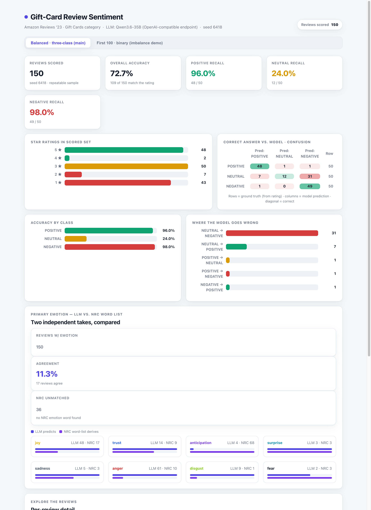
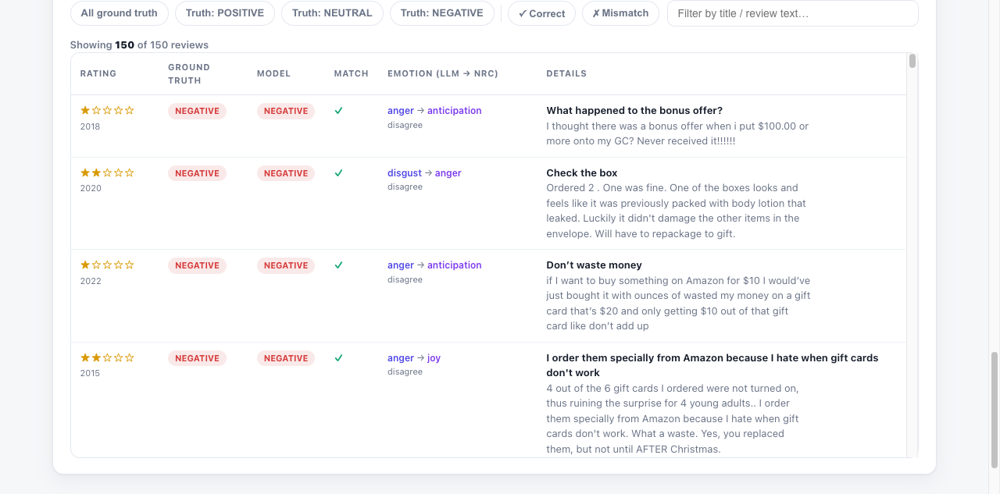

# Amazon Gift-Card Reviews — Sentiment & Emotion Classification

**MBAX 6418 · Assignment 1** — A working review-sentiment classifier for Amazon's **Gift Cards** category (Amazon Reviews '23). The classifier labels each review POSITIVE / NEUTRAL / NEGATIVE, detects the primary emotion, checks its predictions against the star rating, and presents everything in an interactive, self-contained HTML dashboard.

---

## The data

We use the **Amazon Reviews '23** dataset collected by the **McAuley Lab, University of California San Diego** — specifically the **Gift Cards** review category. Every number in this report comes from that file, which is a gzipped JSON Lines file of **152,410 reviews** (the uncompressed file is ~48 MB).

- Dataset site & field reference: <https://amazon-reviews-2023.github.io>
- Direct file: `.../amazon_2023/raw/review_categories/Gift_Cards.jsonl.gz`

**Fields used:** `rating` (the star rating, 1–5, the "correct answer"), `title`, `text`, `verified_purchase`, `helpful_vote`, `timestamp`, `asin`, `user_id`, `images`.

The star-rating distribution of the whole file is **heavily skewed positive** — most reviews are four or five stars:

| Rating | Count | Share |
|---|---|---|
| 5★ | 128,248 | 84.1% |
| 4★ | 6,692 | 4.4% |
| 3★ | 3,271 | 2.1% |
| 2★ | 1,873 | 1.2% |
| 1★ | 12,326 | 8.1% |

Mapped to three classes **88.5%** of reviews are POSITIVE (4–5★), **2.1%** NEUTRAL (3★), and **9.3%** NEGATIVE (1–2★). That imbalance drives the whole analysis below.

## The model

Predictions come from an OpenAI-compatible LLM endpoint (`Qwen3.6-35B`, AWQ 4-bit) via the class endpoint. The model is asked to classify from the **title and body only** — it **never sees the star rating**, which is used only afterwards as ground truth. Every call disables the model's "thinking" mode so the answer comes back as clean, machine-readable content.

## How to run

```bash
# 1. Data: download the Gift Cards JSONL into data/Gift_Cards.jsonl
curl -L -o data/Gift_Cards.jsonl.gz \
  "https://mcauleylab.ucsd.edu/public_datasets/data/amazon_2023/raw/review_categories/Gift_Cards.jsonl.gz"
gunzip -k data/Gift_Cards.jsonl.gz

# 2. Environment
python -m venv .venv && ./.venv/bin/pip install pandas numpy pyarrow

# 3. Steps
./.venv/bin/python -m src.classify spotcheck   # Step 1 — a few obvious reviews
./.venv/bin/python -m src.classify batch1      # Step 2 — first 100 rows, binary (imbalance demo)
./.venv/bin/python -m src.classify balanced    # Steps 5/6 — balanced 50/class, three-class + emotions
./.venv/bin/python -m src.make_dashboard       # Steps 3/4/7 — regenerate dashboard.html

# 4. Open dashboard.html (offline, self-contained)
open dashboard.html
```

Results are cached under `output/_cache` so an interrupted run resumes without re-calling the model. Both runs use a **fixed random seed (6418)**, so the same reviews come up and the same numbers are produced every time.

---

## Step 1 — A structured prompt

The reusable prompt (`src/prompt.py`) hands the model a review's *title* and *text* and asks for a sentiment as machine-readable JSON. It decides edge cases itself: the body is weighted over the title on conflict, terse/angry short reviews are judged by tone, and — critical — **the rating is never shown to the model**.

A quick spot-check of obviously positive and negative reviews behaved correctly:

```
[5★] 'Great gift'       -> POSITIVE
[5★] 'amazon gift card' -> POSITIVE
[5★] 'perfect gift'     -> POSITIVE
[1★] 'Not $10 Gift Cards' -> NEGATIVE
[1★] 'One Star'           -> NEGATIVE
[2★] 'Mistake'            -> NEGATIVE
```

Once this worked we extended the prompt to also name a primary emotion (Step 5) and to distinguish NEUTRAL from POSITIVE/NEGATIVE (Step 6).

## Step 2 — First batch (binary) and the imbalance illusion

We first scored the **first 100 rows in file order** against the binary rule **rating ≥ 4 → POSITIVE, else NEGATIVE**.

| Metric | Value |
|---|---|
| Reviews scored | 100 |
| **Overall accuracy** | **97.0%** (97 / 100) |
| POSITIVE accuracy | 97.8% (91 / 93) |
| NEGATIVE accuracy | 85.7% (6 / 7) |

Confusion (rows = ground truth, columns = prediction):

| | Pred POSITIVE | Pred NEGATIVE |
|---|---|---|
| **Truth POSITIVE** | 91 | 2 |
| **Truth NEGATIVE** | 1 | 6 |

**97% looks excellent — but it is an illusion.** The first 100 rows are 93% positive (5★), i.e. *almost the entire batch is one easy class the model handles trivially*. There are only **7 negative** and **0 neutral** reviews to test the hard classes with. Accuracy this high mostly measures how often the model can say "positive" and be right.

## Steps 5 & 6 — Balanced three-class scoring with emotions

Following the full three-class split (4–5★ POSITIVE, 3★ NEUTRAL, 1–2★ NEGATIVE), we drew a **balanced sample of 50 reviews per class (150 total) from the whole file** with a fixed seed, instead of reading the first N rows in order.

| Class | Correct | Total | Recall (per-class acc.) |
|---|---|---|---|
| POSITIVE | 48 | 50 | 96.0% |
| NEUTRAL | 12 | 50 | **24.0%** |
| NEGATIVE | 49 | 50 | 98.0% |
| **Overall** | **109** | **150** | **72.7%** |

Confusion matrix (rows = ground truth, columns = prediction):

| | Pred POSITIVE | Pred NEUTRAL | Pred NEGATIVE |
|---|---|---|---|
| **Truth POSITIVE** | 48 | 1 | 1 |
| **Truth NEUTRAL** | 7 | 12 | 31 |
| **Truth NEGATIVE** | 1 | 0 | 49 |

**Balance exposes what reading in order hid.** A model that looked "97% accurate" is really **72.7% accurate**. Positive and negative reviews are each caught ~96–98% of the time, but **only 24% of ★★★ neutral reviews keep their own class** — an entire class the first-100 sample barely contained. *See the "Answers" section for the full story.*

### Primary emotion — two independent takes

We estimated each review's primary emotion two ways and compared them:

1. **LLM predicts it** (extended prompt, semantic reading of the whole review).
2. **NRC word list derives it** (`src/nrc.py`; NRC Word-Emotion Association Lexicon / EmoLex v0.92) — a pure bag-of-words count of how many words in the review are annotated to each of the eight emotions, plus a per-emotion total, highest wins.

| Comparison | Value |
|---|---|
| Reviews with an LLM emotion | 150 / 150 |
| Reviews where **LLM and NRC agree** | **17 / 150 (11.3%)** |
| Reviews with **no NRC-associable emotion word** | 36 / 150 |

LLM emotion distribution (dominant): *anger* 61, *joy* 48, *trust* 14, *disgust* 9, *sadness* 5, *anticipation* 4, *surprise* 3, *fear* 2, plus **4 "disappointment"** (outside the eight).
NRC emotion distribution (dominant): **anticipation 68**, *joy* 17, *anger* 10, *trust* 9, *fear* 3, *sadness* 3, *surprise* 3, *disgust* 1, **36 unmatched**.

The two agree only ~1 time in 9 — they are measuring different things. *Details and why in "Answers".*

## Steps 3, 4 & 7 — The dashboard

A **single self-contained `dashboard.html`** (no server, no network, no external libraries) presents everything:



- **Headline KPIs** — reviews scored, overall accuracy, per-class recall.
- **Star-rating distribution** of the scored set.
- **Confusion matrix** — ground truth vs. prediction, correct diagonals highlighted.
- **Accuracy by class** and a **"where it goes wrong"** panel that ranks actual misclassifications (e.g. *NEUTRAL → NEGATIVE: 31*).
- **Emotions** — a side-by-side LLM vs. NRC comparison with an agreement headline and eight per-emotion cards.
- **Interactive review table** — **filter** by ground-truth class (Truth: POSITIVE / NEUTRAL / NEGATIVE) and by Correct vs. Mismatch, plus live text search, all with a **live row count**.



Every number on the page was **cross-checked in the browser against the saved CSVs** (see *Answers*, Q4), and the charts were checked for collapsed or overflowing elements.

---

## Answers

**1. Why did the lopsided run look very accurate, and what did balanced sampling change?**

The first-100 run scored 97.0% because the sampled rows were themselves 93% positive — reading the file in order handed the model mostly 5★ reviews, the one class it finds trivial. Only 7 negative and 0 neutral reviews were present to test anything harder. When we instead sampled **equal numbers of each class (50/class = 150) from the whole file**, overall accuracy fell to **72.7%**. Balanced sampling revealed that the *average* was carried almost entirely by the easy classes: POSITIVE 96%, NEGATIVE 98%, but **NEUTRAL only 24%**. The "97%" was a property of the sample, not of the model.

**2. Where do the model's mistakes go, and in what direction?**

Concrete numbers from the balanced confusion matrix (rows = ground truth, cols = prediction): **NEUTRAL → NEGATIVE: 31**, NEUTRAL → POSITIVE: 7, POSITIVE → NEUTRAL: 1, POSITIVE → NEGATIVE: 1, NEGATIVE → POSITIVE: 1. So **★★★ (neutral) reviews strongly collapse into NEGATIVE**, several into POSITIVE, and only 12 of 50 stay NEUTRAL. Negative reviews almost never get called neutral (0), and positive/negative are each only ever misclassified once. The collision is essentially one-directional: *neutral is swallowed by negative (and some positive), not the reverse.*

**3. How do the LLM's emotions and the word list's emotions differ, and why?**

They agree only 11.3% of the time. The **LLM reads context**: a review like *"Never received my bonus… never again!"* is understood as anger even though no *lexicon word* for anger appears. It also returned an emotion outside the fixed eight (*disappointment* × 4). The **NRC list is a frequency counter**: it sums how many words carry a pre-annotated emotion link, with no sensitivity to negation or context — *"not happy"* still counts *joy*, and *"gift / order / deliver / get / receive"* (common in gift-card reviews) are all annotated with *anticipation*, inflating *anticipation* to a dominant 68 hits. It also left 36 of 150 reviews with **no emotion at all** because no word in them appears in the lexicon. The divergence is structural: a contextual, whole-review reading vs. a literal bag-of-words count.

**4. What bugs / issues did you hit, and how did you work around them?**

- **Reasoning-model output:** the LLM first returned `content: null` with its reply buried in a separate *reasoning* field (hitting its token cap mid-thought). We fixed it by sending `chat_template_kwargs: {"enable_thinking": false}`, so answers come back as plain content.
- **Python env / PEP 668:** the system Python is externally managed and had no pandas/numpy/pyarrow, so we built a venv (`.venv/`), installed the stack, and added `pyarrow` for Parquet support.
- **Non-JSON-serializable numpy:** `metrics.json` writing choked on `numpy.int64`; we cast counts and accuracies to native Python int/float.
- **Pandas row merge:** merging classification results into a row failed because a pandas row is a Series, not a dict — converted with `dict(row)`.
- **Renamed-column bookkeeping:** the accuracy function looked for a `_correct` column that had already been renamed `ground_truth`; we made the column name a parameter and re-ran against the **results cache**, so no API calls were wasted.
- **Dashboard JS runtime errors:** a tab switch crashed because `renderKpis` read `per_class.`**NEUTRAL**, which doesn't exist for the binary dataset — it threw and silently halted the rest of the page. We made the KPI cards data-driven per class. Three other renderers read `stats.classes` when classes live at the dataset level, so they never ran; that's now `b.classes`.
- **Verification discipline:** because the images couldn't be viewed by the driving model, layout QA was done with DOM measurements — asserting **every chart bar has non-zero width** (no collapsed/zero-width elements), **no horizontal overflow**, and that rendered confusion cells (48,1,1 / 7,12,31 / 1,0,49) and per-class recalls match the saved CSVs exactly. Filtering was exercised end-to-end (e.g. "Mismatch" → exactly the 3 off-diagonal rows; "Truth: NEUTRAL" → exactly 50 rows).
- **Repo hygiene:** the raw data (48 MB JSONL + the downloaded lexicon) is large and re-downloadable, so it is excluded from git via `.gitignore`; the code, generated dashboard, outputs, and this report are committed.

---

## Repository layout

```
data/                     (gitignored) raw Gift Cards review JSONL + NRC lexicon
src/
  config.py               endpoint, paths, seed, class mappings
  prompt.py               the reusable classification prompt + parser
  llm.py                  OpenAI-compatible client (thinking off, retries)
  data.py                 load reviews, balanced sampling with fixed seed
  nrc.py                  NRC word-list emotion scoring
  classify.py             the scoring script (spotcheck / batch1 / balanced)
  make_dashboard.py       dashboard generator (Steps 3/4/7)
output/
  batch1_100.csv          raw Step-2 binary output
  batch1_100_metrics.json
  balanced_150.csv        raw balanced three-class output (+ emotions)
  balanced_150_metrics.json
  _cache/                 per-review LLM cache (resumable) — gitignored
media/dashboard-*.png     report screenshots
dashboard.html            the delivered self-contained dashboard
README.md                 this report
```

**Deliverables:** the prompt (`src/prompt.py`), the scoring script (`src/classify.py`), the word-list script (`src/nrc.py`), the dashboard generator (`src/make_dashboard.py`), one balanced raw output (`output/balanced_150.csv`), and the final dashboard (`dashboard.html`).

Data: **Amazon Reviews '23** (McAuley Lab, UC San Diego) — <https://amazon-reviews-2023.github.io> · NRC Emotion Lexicon v0.92 (Mohammad & Turney).
